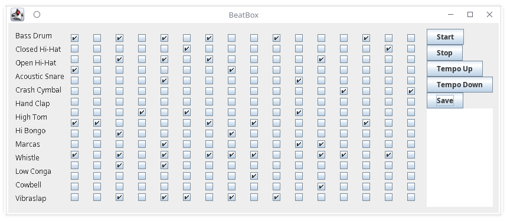

# MusicApp

 
A beatbox pattern generating app where our own prepared pattern can also be saved in MySQL database 

## Resources
1. [MIDI package in Java](https://docs.oracle.com/javase/tutorial/sound/overview-MIDI.html)
2. [MySQL](https://www.mysql.com/)
3. [JDK 1.8](https://www.oracle.com/technetwork/java/javase/downloads/jdk8-downloads-2133151.html)

## Midi Package
MIDI is both a hardware specification and a software specification. The brief hardware portion of the MIDI specification prescribes the pinouts for MIDI cables and the jacks into which these cables are plugged. This portion need not concern us. Because devices that originally required hardware, such as sequencers and synthesizers, are now implementable in software, perhaps the only reason for most programmers to know anything about MIDI hardware devices is simply to understand the metaphors in MIDI. However, external MIDI hardware devices are still essential for some important music applications, and so the Java Sound API supports input and output of MIDI data.
The software portion of the MIDI specification is extensive. This portion concerns the structure of MIDI data and how devices such as synthesizers should respond to that data. It is important to understand that MIDI data can be streamed or sequenced. This duality reflects two different parts of the Complete MIDI 1.0 Detailed Specification:
1.MIDI 1.0
2.Standard MIDI Files

## MySQL
MySQL is the most popular Open Source Relational SQL Database Management System. MySQL is one of the best RDBMS being used for developing various web-based software applications.
MySQL is a very powerful program in its own right. It handles a large subset of the functionality of the most expensive and powerful database packages.
MySQL works very quickly and works well even with large data sets.

## Screenshot

